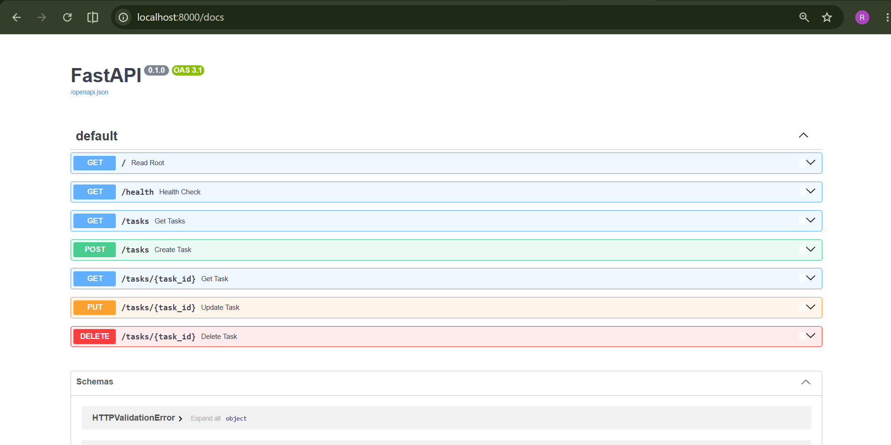
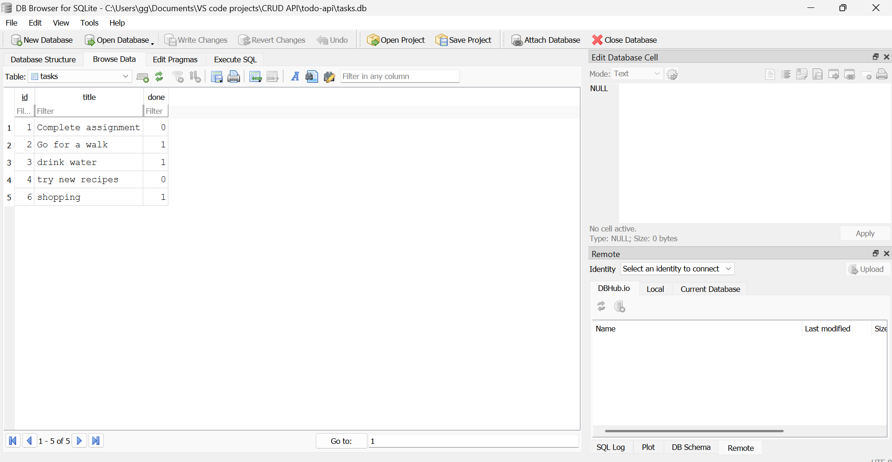

# Task API

A simple REST API built with Python and FastAPI for managing tasks.

This project was built step by step as part of a CRUD API assignment. It uses an in-memory list to store tasks and supports creating, reading, updating, and deleting tasks.

## Features

- Create tasks
- View all tasks
- View a single task
- Update tasks
- Delete tasks
- Input validation
- Appropriate HTTP status codes
- Interactive Swagger API documentation

## Requirements

- Python 3
- FastAPI
- Uvicorn
- Git

## Installation & Running

1. Clone the repository:

```bash
git clone https://github.com/RaihanasProjects/Todo-api.git
cd todo-api
```

2. Create a virtual environment:

```bash
python -m venv venv
```

3. Activate the virtual environment on Windows:

```bash
venv\Scripts\activate
```

4. Install the required packages:

```bash
pip install fastapi uvicorn
```

5. Start the server:

```bash
uvicorn main:app --reload
```

The API will be available at:

http://localhost:8000

Swagger UI documentation is available at:

http://localhost:8000/docs

## API Endpoints

GET, `/`, Get information about the API, 200
GET, `/health`, Check if the API is running, 200
GET, `/tasks`,  Get all tasks, 200
GET, `/tasks/{task_id}`, Get a single task by ID, 200
POST, `/tasks`, Create a new task, 201
PUT, `/tasks/{task_id}`, Update an existing task,  200
DELETE, `/tasks/{task_id}`, Delete a task,  204

## Example Request

The following example retrieves a single task:

```bash
curl -i http://localhost:8000/tasks/1
```

Example response:

```text
HTTP/1.1 200 OK
date: Mon, 24 Aug 2026 06:41:50 GMT
server: uvicorn
content-length: 51
content-type: application/json

{"id":1,"title":"Complete assignment","done":false}
```

## Swagger UI

Interactive API documentation is available through FastAPI's automatically generated Swagger UI.

When the server is running, open:

http://localhost:8000/docs

The Swagger UI allows users to view and test all API endpoints directly from the browser.

### Swagger Screenshot



## Database

This project uses SQLite because it is lightweight, simple to set up, and does not require a separate database server.

The database is stored in the project folder as:

`tasks.db`

The database and `tasks` table are automatically created when the FastAPI application starts.

### How to Start

1. Create and activate the virtual environment:

```bash
py -m venv venv
venv\Scripts\activate

3.start the server:

```bash
uvicorn  main:app --reload

The API will be available at:

http://127.0.0.1:8000

## Example SQL Query
One SQL query I executed using DB Browser for SQLite was:

SELECT * FROM tasks WHERE done = 1;

This query returns all completed tasks.

### Database Screenshot

The database was viewed and tested using **DB Browser for SQLite**.


